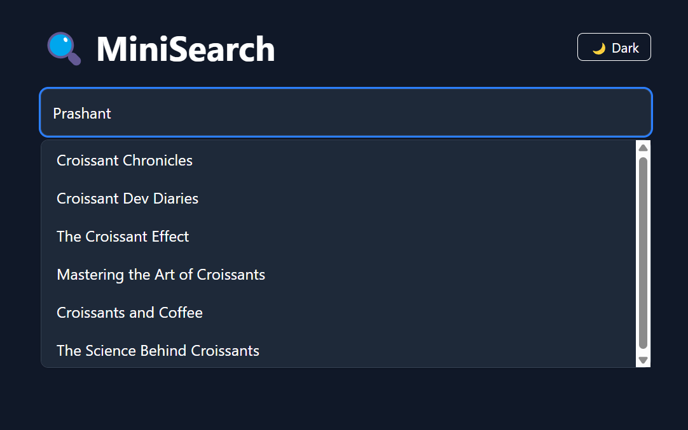
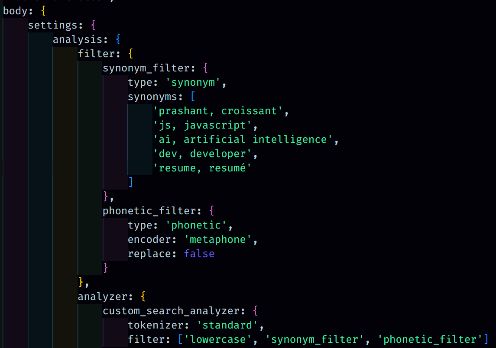

# Mini Elastic Search App



## Table of Contents
1. [What is Elastic Search?](#what-is-elastic-search)
    - [Key Features](#key-features)
2. [Types of Search in Elastic Search](#types-of-search-in-elastic-search)
    - [Semantic Search](#semantic-search)
    - [Phonetic Search](#phonetic-search)
    - [Synonymic Search](#synonymic-search)
3. [Steps to Run the Application](#steps-to-run-the-application)
    - [Server Setup](#server-setup)
    - [Client Setup](#client-setup)
4. [Endpoints to Test](#endpoints-to-test)

---

## What is Elastic Search?

Elastic Search is an open-source search engine built on Apache Lucene. It provides a distributed, multitenant-capable full-text search engine with an HTTP web interface and schema-free JSON documents. Elastic Search is designed for horizontal scalability, reliability, and real-time search capabilities.

### Key Features
- **Full-Text Search**: Perform powerful and fast searches on large datasets.
- **Scalability**: Easily scale horizontally by adding more nodes to the cluster.
- **Real-Time Data**: Index and search data in near real-time.
- **RESTful API**: Interact with Elastic Search using simple HTTP requests.
- **Analytics**: Perform aggregations and analyze data efficiently.

---

# Types:
# Semantic Search
Semantic search focuses on understanding the intent and contextual meaning behind the search query rather than just matching keywords. It uses natural language processing (NLP) techniques to interpret the relationships between words and phrases.

**Example Use Case**:
- Searching for "best laptops for programming" returns results that include laptops optimized for coding, even if the exact phrase isn't present in the documents.

# Phonetic Search
Phonetic search is designed to find words that sound similar to the search query. It is commonly used for handling misspellings, variations in pronunciation, or names that are phonetically similar.

**Example Use Case**:
- Searching for "Jon" might also return results for "John" or "Jhon."

# Synonymic Search
Synonymic search expands the search query to include synonyms of the terms provided. This ensures that the search results are more comprehensive and relevant.

**Example Use Case**:
- Searching for "car" might also return results for "Prashant" or "Crossiant."



---

## Steps to Run the Application

Follow these steps to set up and run the Mini Elastic Search App:

### Server Setup
1. Navigate to the `server` directory:
    ```bash
    cd server
    ```
2. Start the Elastic Search service using Docker:
    ```bash
    docker run build
    docker-compose up
    ```
3. Install the required dependencies:
    ```bash
    pnpm install
    ```
4. Seed the database with sample data:
    ```bash
    node seed.js
    ```
5. Start the server:
    ```bash
    node server.js
    ```

### Client Setup
6. Navigate to the `client` directory:
    ```bash
    cd client
    ```
7. Install the required dependencies:
    ```bash
    pnpm install
    ```
8. Start the development server:
    ```bash
    pnpm run dev
    ```
9. Open the application in your browser:
    ```
    http://localhost:5173
    ```

---

## Endpoints to Test

You can test the following endpoints to interact with the application:

**Go to [localhost:5173](http://localhost:5173) to view the application UI.**

1. **Elastic Search API**:
    ```
    http://localhost:9200/articles/_search
    ```
    Use this endpoint to query the Elastic Search index directly.

2. **Search API (Query: `elasticsearch`)**:
    ```
    http://localhost:3001/search?q=elasticsearch
    ```
    Use this endpoint to search for articles related to "elasticsearch."

3. **Search API (Query: `node`)**:
    ```
    http://localhost:3001/search?q=node
    ```
    Use this endpoint to search for articles related to "node."

---

