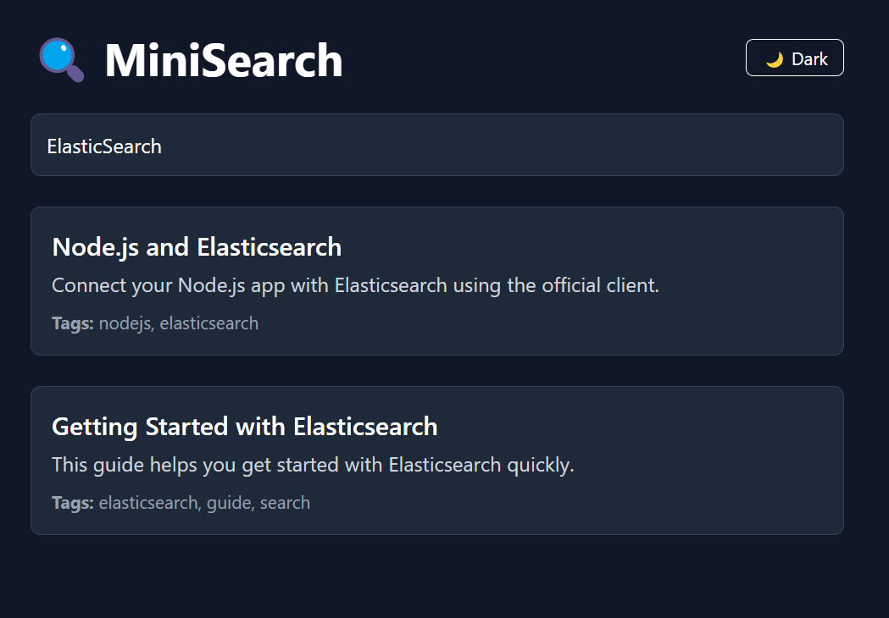

# Mini Elastic Search App

This project demonstrates a simple implementation of an Elastic Search application. Elastic Search is a distributed, RESTful search and analytics engine capable of addressing a growing number of use cases. It is commonly used for log and event data analysis, full-text search, and real-time application monitoring.

## What is Elastic Search?

Elastic Search is an open-source search engine built on Apache Lucene. It provides a distributed, multitenant-capable full-text search engine with an HTTP web interface and schema-free JSON documents. Elastic Search is designed for horizontal scalability, reliability, and real-time search capabilities.

### Key Features:
- **Full-Text Search**: Perform powerful and fast searches on large datasets.
- **Scalability**: Easily scale horizontally by adding more nodes to the cluster.
- **Real-Time Data**: Index and search data in near real-time.
- **RESTful API**: Interact with Elastic Search using simple HTTP requests.
- **Analytics**: Perform aggregations and analyze data efficiently.

---

## Steps to Run the Application

Follow these steps to set up and run the Mini Elastic Search App:

### Server Setup
1. Navigate to the `server` directory:
    ```bash
    cd server
    ```
2. Start the Elastic Search service using Docker:
    ```bash
    docker-compose up
    ```
3. Install the required dependencies:
    ```bash
    pnpm install
    ```
4. Seed the database with sample data:
    ```bash
    node seed.js
    ```
5. Start the server:
    ```bash
    node server.js
    ```

### Client Setup
6. Navigate to the `client` directory:
    ```bash
    cd client
    ```
7. Install the required dependencies:
    ```bash
    pnpm install
    ```
8. Start the development server:
    ```bash
    pnpm run dev
    ```
9. Open the application in your browser:
    ```
    http://localhost:5173
    ```

---

## Endpoints to Test

You can test the following endpoints to interact with the application:

1. Elastic Search API:
    ```
    http://localhost:9200/articles/_search
    ```
    Use this endpoint to query the Elastic Search index directly.

2. Search API (Query: `elasticsearch`):
    ```
    http://localhost:3001/search?q=elasticsearch
    ```
    Use this endpoint to search for articles related to "elasticsearch."

3. Search API (Query: `node`):
    ```
    http://localhost:3001/search?q=node
    ```
    Use this endpoint to search for articles related to "node."

---

